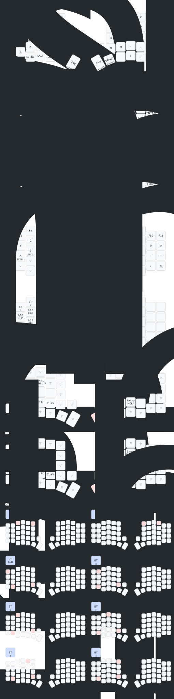

# Advanced Sofle V2 Keyboard - Ergonomic ZMK Firmware

This repository contains a highly customized ZMK firmware for the Sofle V2 keyboard with wireless Nice!Nano controllers. The keymap is inspired by and adapted from the glove80 layout, featuring advanced ergonomic capabilities that transform the Sofle into a premium typing experience.

## 🎹 Advanced Features

### Complete Layer System (5 Layers)
- **Layer 0**: QWERTY base with home row mods
- **Layer 1**: Symbol layer (programming symbols + navigation)
- **Layer 2**: Cursor layer (navigation + editing commands)
- **Layer 3**: Number layer (numpad + function keys)
- **Layer 4**: Adjust layer (Bluetooth + RGB controls)

### Home Row Mods (macOS Optimized)
All modifier keys accessible from home row without moving hands:
- **Left**: A(Ctrl), S(Alt), D(Cmd), F(Shift)
- **Right**: J(Shift), K(Cmd), L(Alt), ;(Ctrl)

**Bilateral design** prevents misfires during fast typing:
- Same-hand combos (e.g., `s` + `t`) → just types "st"
- Cross-hand combos (e.g., `a` + `j`) → Ctrl+J
- Thumb combos always work (e.g., `a` + `space`) → Ctrl+Space

### Glove80-Style Behaviors
- **Tap-then-hold auto-repeat**: Fast deletion/spacing without losing layer access
- **Layer-tap thumb keys**: Hold for layers, tap for keys
- **Software bootloader access**: No physical buttons needed for flashing

## 📊 Current Keymap

## 🚀 Layer Access & Usage

### Thumb Key Layer-Tap Access
- **Hold Backspace** → **Cursor Layer** (navigation/editing)
- **Hold Tab** → **Number Layer** (numpad/F-keys)
- **Hold Space** → **Symbol Layer** (programming symbols + navigation)

### Advanced Layer Features

#### Symbol Layer (Layer 1)
**Programming-focused with integrated navigation:**
- **Left side**: Brackets `[]{}()`, operators `^=_$*`, symbols `~<|>/#`
- **Right side**: Arrow keys `←↑↓→`, editing keys (backspace/space/tab/enter)
- **Thumb cluster**: Home, Page Up/Down, End

#### Cursor Layer (Layer 2)
**Text editing and navigation:**
- Cut, Copy, Paste, Undo, Redo
- Select All, Select Line, Select Word
- Find, Find Next, Find Previous
- Arrow navigation and page controls

#### Number Layer (Layer 3)
**Complete numpad with function keys:**
- **Function keys**: F1-F12 across top row
- **Numpad layout**: Traditional 789/456/123 arrangement
- **Hex digits**: A-F for programming
- **Math operators**: `+-*/%=`
- **Two zero positions**: Left bottom + right thumb

#### Adjust Layer (Layer 4)
**System controls (activated by Symbol + Cursor layers):**
- **Bluetooth**: Clear all, switch between 5 paired devices
- **RGB**: Toggle, hue/saturation/brightness, effects
- **Power management**: External power toggle

## 🔧 Software Bootloader Access

### No Physical Buttons Needed!
Enter bootloader mode using key combinations:
- **Left half**: Press `2` + `5` within 500ms
- **Right half**: Press `9` + `6` within 500ms

### Usage
1. Press appropriate combo → Enters bootloader mode
2. Drag `.uf2` file to USB drive
3. Firmware flashes automatically

## 🎯 Advanced Behaviors

### Tap-Then-Hold Auto-Repeat (Glove80-Style)
All thumb layer-tap keys support intelligent auto-repeat:
1. **Single tap** → Normal key (backspace/tab/space)
2. **Direct hold** → Layer access
3. **Tap-then-hold** → **Fast auto-repeat** (bypasses layer!)

**Example**: Tap backspace once, then quickly hold = rapid deletion without entering cursor layer.

## ⚡ Flashing & Building

### Automatic Building
The repository uses GitHub Actions to automatically build firmware:
- **Triggers**: Push, pull request, or manual workflow dispatch
- **Output**: `.uf2` firmware files in Actions artifacts
- **Files generated**:
  - `sofle_left-nice_nano_v2-zmk.uf2`
  - `sofle_right-nice_nano_v2-zmk.uf2`
  - `settings_reset-nice_nano_v2-zmk.uf2`

### Manual Building
Trigger builds manually via GitHub Actions tab in the repository.

## 🔥 Flashing Process

### Recommended Flashing Order
1. **Turn off both keyboard halves**
2. **Flash right half**: Use combo `0+6` → drag `sofle_right-nice_nano_v2-zmk.uf2`
3. **Flash left half**: Use combo `1+5` → drag `sofle_left-nice_nano_v2-zmk.uf2`
4. **Turn on right half** → Should show WiFi connection checkmark
5. **Test both halves** in text editor

### Alternative: Physical Button Method
If combos don't work, use physical BOOT button:
1. Connect keyboard via USB-C
2. Double-press "BOOT" button quickly
3. Drag appropriate `.uf2` file to USB drive
4. Keyboard reboots automatically

### Troubleshooting
- **Flash `settings_reset-nice_nano_v2-zmk.uf2` first** if having issues
- **Only one half powered** during flashing (turn off the other side)
- **OLED screen blank after reset flash** = successful reset confirmation

## 📝 Configuration Details

### Home Row Mod Timing
- **Tapping term**: 280ms (hold threshold)
- **Quick-tap**: 175ms (enables auto-repeat)
- **Prior-idle**: 150ms (prevents accidental activation)

### Layer-Tap Behavior
- **Tapping term**: 200ms (layer activation threshold)
- **Quick-tap**: 200ms (enables tap-then-hold auto-repeat)
- **Retro-tap**: Enabled (forgiveness for accidental holds)

### Hardware Features
- **OLED displays**: Enabled
- **Rotary encoders**: Enabled
- **RGB underglow**: Available (disabled by default)
- **Nice!Nano v2**: Wireless with Bluetooth 5

## 🎮 Usage Examples

### Common Shortcuts (macOS)
- **Copy**: Hold A (Ctrl) + tap C
- **Paste**: Hold A (Ctrl) + tap V
- **App Switch**: Hold D (Cmd) + tap Tab
- **Spotlight**: Hold D (Cmd) + tap Space

### Programming Workflow
1. **Hold Space** → Enter symbol layer
2. **Type brackets/operators** (left hand)
3. **Navigate with arrows** (right hand)
4. **Edit with backspace/tab/enter** (right hand)
5. **Release Space** → Return to base layer

### Number Entry
1. **Hold Tab** → Enter number layer
2. **Use traditional numpad** (789/456/123)
3. **Access function keys** (F1-F12)
4. **Math operations** with `+-*/%` operators

## ✨ What Makes This Special

This firmware transforms the Sofle V2 into a premium ergonomic experience:

### Ergonomic Excellence
- **No finger stretching** for modifiers (home row mods)
- **Thumb-based layer access** (most efficient digits)
- **Glove80-inspired workflows** adapted for compact layout
- **Smart auto-repeat** that doesn't interfere with layers

### Programming Optimized
- **Symbol layer** with integrated navigation
- **Hex digit support** (A-F) for development
- **All brackets easily accessible** `()[]{}`
- **Function keys** readily available (F1-F12)

### Modern Conveniences
- **Software bootloader access** (no physical button fumbling)
- **Bluetooth device management** (5 device slots)
- **Automatic firmware building** via GitHub Actions
- **Wireless split design** with OLED feedback 

## 🔧 Customization

### Online Keymap Editor
This repository is compatible with the [ZMK Keymap Editor](https://nickcoutsos.github.io/keymap-editor) for easy GUI-based customization.

### Manual Keymap Editing
- **Main config**: [`config/sofle.keymap`](config/sofle.keymap)
- **Hardware settings**: [`config/sofle.conf`](config/sofle.conf)
- **Build matrix**: [`build.yaml`](build.yaml)

### Advanced Customization
Review the [ZMK Documentation](https://zmk.dev/docs/features/keymaps) for detailed information on:
- Behavior customization
- Timing adjustments
- Additional layer creation
- Combo key assignments

### Hardware Notes
- **5-way rotary encoder**: Configured on right side
- **OLED displays**: Show layer status and connection info
- **RGB underglow**: Available but disabled by default for battery life

---

**This configuration represents hundreds of hours of ergonomic optimization, bringing premium keyboard features to the accessible Sofle V2 platform. Enjoy your enhanced typing experience!** ⌨️✨ 
